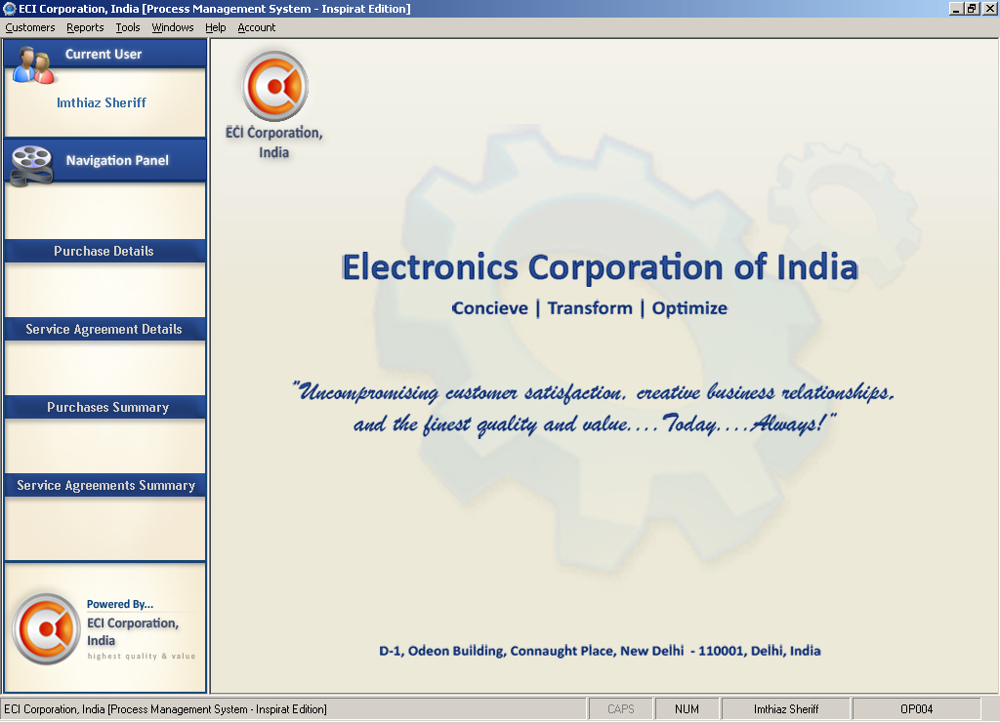



## Process Management System \[Electronics Corp\. Of India\]

### Description

This is a prototype application that covers the key functions of a Process Management System of a retail store. The store deals in the sale of electronic items such as televisions, video record players etc. The application uses SQL Server 2005 as the back end and VB6 as the front end. Instructions on how to install and run the application have been provided for your convenience.

On another note, I would greatly appreciate it if you could please leave behind a positive vote and your thoughts, comments or feedback. Good luck with running the application and thanks for your time! Have a nice day! Cheers!! :)
 
### More Info
 

             |
---                |---
**Submitted On**   |2009-01-29 22:25:30
**By**             |[Ahamed Imran Sheriff](https://github.com/Planet-Source-Code/PSCIndex/blob/master/ByAuthor/ahamed-imran-sheriff.md)
**Level**          |Intermediate
**User Rating**    |4.4 (53 globes from 12 users)
**Compatibility**  |VB 6\.0
**Category**       |[Complete Applications](https://github.com/Planet-Source-Code/PSCIndex/blob/master/ByCategory/complete-applications__1-27.md)
**World**          |[Visual Basic](https://github.com/Planet-Source-Code/PSCIndex/blob/master/ByWorld/visual-basic.md)
**Archive File**   |[Process\_Ma214235212009\.zip](https://github.com/Planet-Source-Code/ahamed-imran-sheriff-process-management-system-electronics-corp-of-india__1-71707/archive/master.zip)

